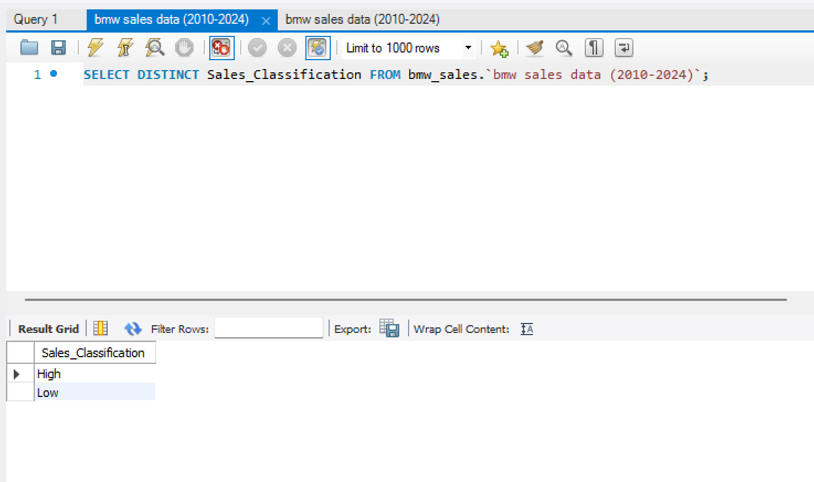
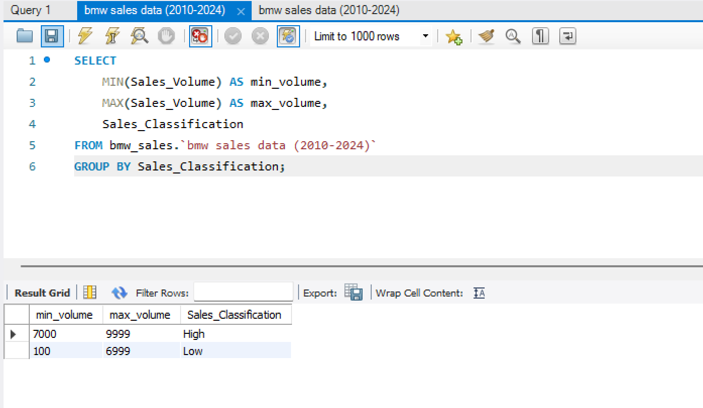
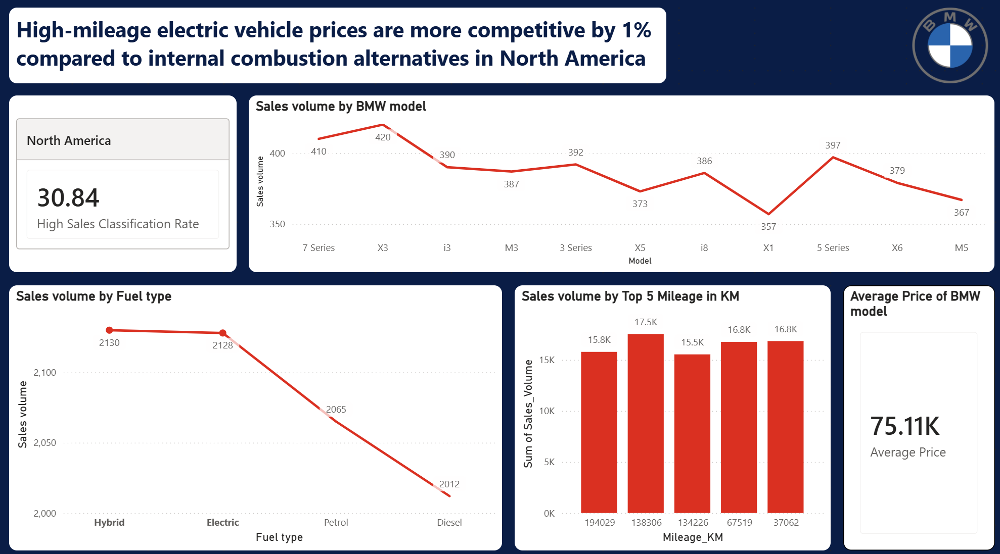
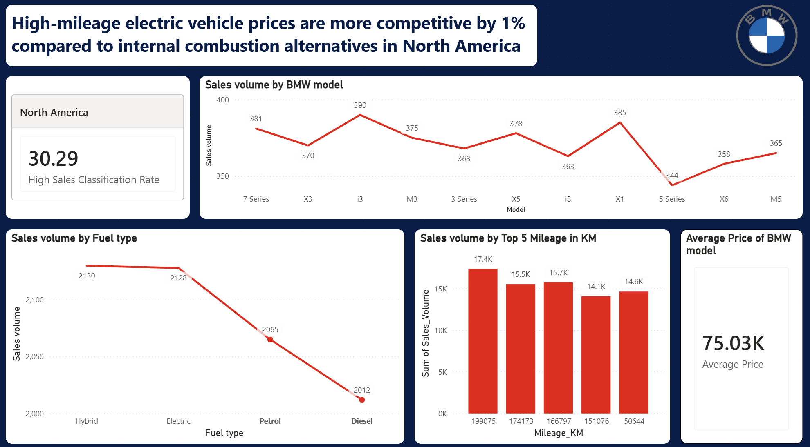

# BMWSales

## Business Context
BMW EuroDrive, a key regional sales division based in Singapore, manages the distribution and sales performance of luxury vehicles across diverse international markets including Europe, North America, and Asia. As the automotive industry shifts toward electrification and sustainable mobility, the company must balance its traditional high-performance internal combustion engine (ICE) heritage with a rapidly expanding fleet of electric (i-series) and hybrid models. Current market conditions are characterized by fluctuating regional demand, varied fuel-type preferences, and a highly competitive luxury segment where pricing strategies directly impact sales velocity and market share.
​

## Problem Background
Despite a robust portfolio spanning from the entry-level 1 Series to the high-performance M5 and flagship i8, BMW EuroDrive has observed inconsistent sales classifications across its global regions. Preliminary reports indicate that certain high-performance models are struggling in regions where fuel prices have spiked, while newer electric models like the i3 show erratic performance despite aggressive subsidies in specific markets. The sales manager is currently unable to pinpoint the exact combination of "Price-to-Mileage" efficiency and "Model-Year" relevance that consistently triggers a "High" Sales Classification, leading to overstocked inventory in underperforming regions.

## Stakeholder Request
"Our global sales data from 2010 to 2024 shows a fragmented performance landscape. I need you to determine which specific vehicle configurations—focusing on the interplay between FuelType, MileageKM, and Region—are the primary drivers of our 'High' sales volume category. Specifically, I want to know if our pricing for high-mileage electric vehicles in North America is competitive enough to maintain market leadership, or if we are losing ground to cheaper internal combustion alternatives."

## Phase 1: Define problem
Based on the context above, I understand that my sales manager requires a high level overview of the sales data of car models categorized in the 'High' Sales Classification to visualize:
- The relationship between the vehicles, their configurations and how it affects the 'High' sales volume of BMW cars
- How well the sales of high-mileage electric vehicles in North America is doing vs cheaper internal combustion alternatives
- The relationship between the price to mileage and model to year for each cars

Ultimately, he needs to understand historical data for a data driven action to trigger 'High' sales for high-mileage electric model vs internal combustion alternatives of BMW cars so that he can allocate inventory in North America based on demand.

## Phase 2: Clean dataset
The dataset is generally clean so there was not much cleaning required to be done.

## Phase 3: Analyze dataset
I can see that there are multiple different characteristics to a BMW car:
- Model
- Year released
- Color
- Fuel Type
- Transmission
- Engine Size
- Mileage
- Total sales
- Total units sold

I noticed there is a categorization column "Sales_Classification" that I do not understand the criteria for categorization.

I ran a SQL query to identify the unique categorizations as 'High' and 'Low'.

From this SQL query, I am able to see how the car sales are categorized by their volume:

- High = 7000 - 9999
- Low = 100 - 6999

So according to this, I understand that I need to find patterns for those cars where their sales volume are between 7000 to 9999 so that we can replicate the sales strategy for those cars where their sales volume are between 100 - 6999.

## Phase 4: Visualize dataset
Based on the dashboard, we can see that electric/hybrid vehicles of top 5 high mileage has high sales classification rate of 30.84 and sold at an average price of 75.11K.

For internal combustion vehicles of top 5 high mileage that uses petrol and diesel, the high sales classification rate is 30.29 and sold at an average price of 75.03K.

So there is a 0.11% less price difference between electric vehicles and internal combustion vehicles and a higher sales rate for electric vehicles.

Therefore, we can conclude that high-mileage electric vehicle prices are more competitive by 0.11% compared to internal combustion alternatives in North America.

## Phase 5: Recommendations

I have summarized the recommendations for leadership to act on in the PPTX slide.

## Phase 6: Conclusion

This project demonstrated how I can use data analysis and visualization to gain insights from huge amount of data on vehicle sales from the car brand, BMW, to recommend data-driven decisions to leadership on future sales strategy.

